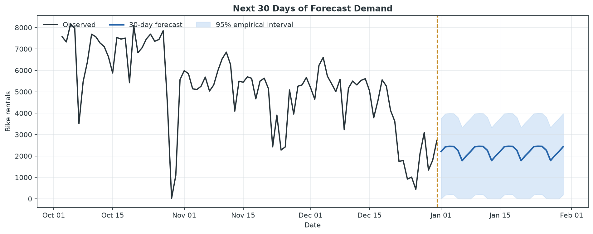
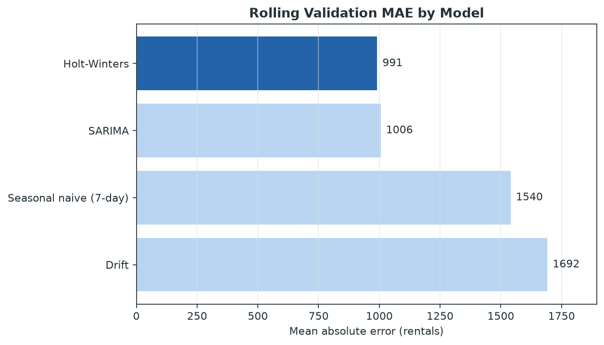
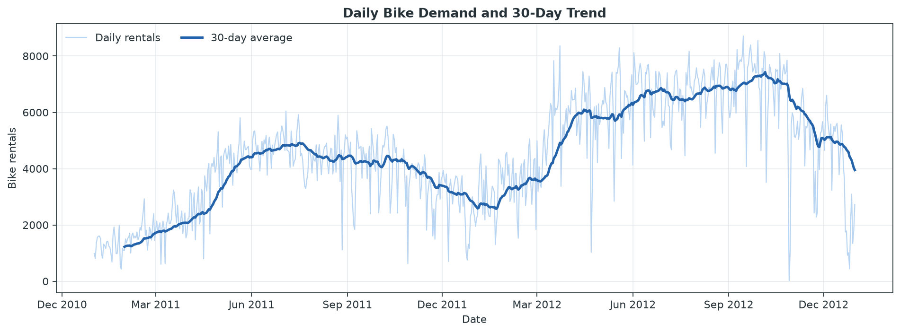
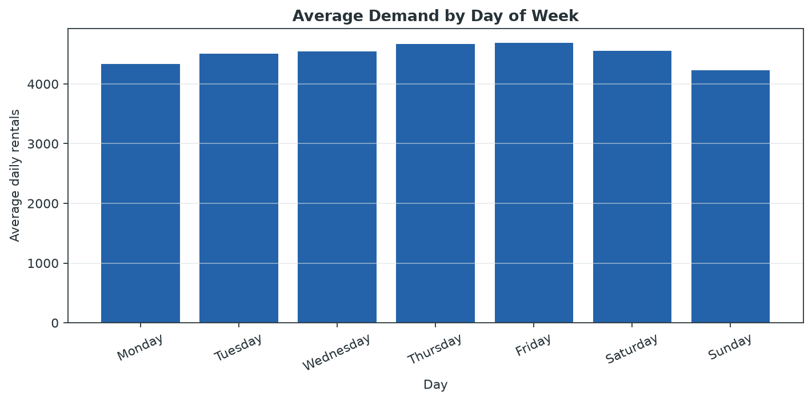
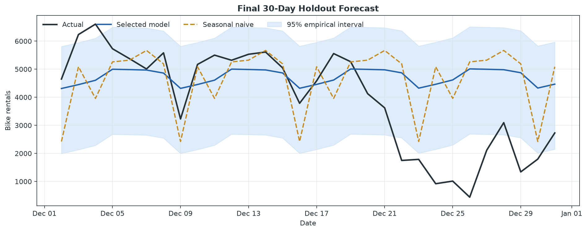

# Daily Bike Demand Forecasting

[](https://github.com/sagarmandavkar-UX/daily-bike-demand-forecasting/actions/workflows/ci.yml)
[](https://www.python.org/)
[](LICENSE)
[](data/README.md)

Can historical demand predict the next 30 days of bike rentals?

This end-to-end time-series project analyzes trend and weekly seasonality, compares four forecasting approaches with expanding-window validation, tests the selected model on a final untouched 30-day period, and produces a future 30-day planning forecast with uncertainty intervals.



## Business answer

**Holt-Winters was the best validation model, but it is not ready for unattended operational use.**

- Validation MAE: **990.878 rentals**
- Final holdout MAE: **1,480.163 rentals**
- Holdout improvement over the 7-day seasonal baseline: **3.10%**
- Holdout MASE: **1.617**
- Deployment decision: **NO-GO**

The future 30-day point forecast averages **2,234 rentals per day**, or approximately **67,032 rentals** in total. Treat it as a planning baseline for fleet rebalancing, maintenance staffing, and capacity—not as an automatic operating commitment.

## Why this result matters

A forecasting project is useful only if it beats a realistic baseline on future-like data. The model won rolling validation but did not clear the final gate of at least 5% lower MAE and MASE below 1.0. The December holdout contains sharp holiday and weather-sensitive changes that historical demand alone cannot explain reliably.

This is an honest modeling outcome: use the forecast with a buffer, collect more history, and add forecast-time weather, holiday, system-capacity, and event inputs before production deployment.

## Dataset

The project uses the real [UCI Bike Sharing dataset](https://archive.ics.uci.edu/dataset/275/bike+sharing+dataset) created by Hadi Fanaee-T:

- 731 complete daily observations
- 2011-01-01 to 2012-12-31
- Total daily Capital Bikeshare rentals
- No missing values or duplicate dates
- Target reconciles exactly: casual + registered = total
- Dataset license: CC BY 4.0

The historical demand series is modeled without future weather data, preventing feature leakage. See [data/README.md](data/README.md) for attribution and licensing.

## Forecasting workflow

```text
UCI daily rentals
       │
       ▼
Data-quality and calendar checks
       │
       ▼
Trend, weekly seasonality, and stationarity analysis
       │
       ▼
3 expanding 30-day validation folds
       │
       ├── Seasonal naive (7-day)
       ├── Drift
       ├── Holt-Winters
       └── SARIMA
       │
       ▼
Select lowest validation MAE
       │
       ▼
Untouched final 30-day holdout
       │
       ▼
Refit on all history and forecast the next 30 days
```

Random train/test splitting is never used.

## Model comparison

| Model | Rolling CV MAE | Rolling CV RMSE | Rolling CV MASE |
|---|---:|---:|---:|
| Holt-Winters | **990.878** | **1,428.069** | **1.147** |
| SARIMA | 1,005.512 | 1,505.883 | 1.162 |
| Seasonal naive (7-day) | 1,540.356 | 2,103.959 | 1.769 |
| Drift | 1,691.586 | 1,934.421 | 1.961 |



MAPE is included in the machine-readable reports but is not used for selection because very low-demand days make percentage errors unstable. MAE is the primary planning metric; WAPE, RMSE, MASE, and bias provide complementary views.

SARIMA directly covers the ARIMA-family approach suggested in the project brief. Prophet was not added because Holt-Winters already provides a transparent decomposable trend/seasonality model for this comparison. An LSTM is deliberately omitted: 731 daily observations are too limited to justify a high-capacity neural sequence model without a substantial overfitting risk. Both are reasonable follow-ups when more history and external predictors are available.

## Trend and seasonality



The 30-day moving average shows strong growth across the two-year period. The Augmented Dickey-Fuller test does not reject a unit root at 5% (p = 0.3427), consistent with a non-stationary level series.



Daily demand also varies by weekday, but weekly recurrence alone is not sufficient for the final holiday-heavy holdout.

## Holdout result



| Metric | Holt-Winters | Seasonal naive |
|---|---:|---:|
| MAE | 1,480.163 | 1,527.567 |
| RMSE | 1,932.709 | 2,054.837 |
| WAPE | 37.466% | 38.665% |
| MASE | 1.617 | 1.669 |
| Bias | +772.601 | +687.900 |

Positive bias means the model overforecast demand on average.

## Repository structure

```text
.
├── data/
│   ├── README.md
│   └── raw/
├── notebooks/
│   └── bike_demand_forecasting.ipynb
├── reports/
│   ├── figures/
│   ├── cross_validation_metrics.csv
│   ├── future_30_day_forecast.csv
│   ├── holdout_forecast.csv
│   ├── model_comparison.csv
│   └── summary.json
├── scripts/
├── src/bike_demand/
├── tests/
├── FORECAST_CARD.md
└── pyproject.toml
```

## Run locally

```bash
python -m venv .venv
source .venv/bin/activate
python -m pip install -e ".[dev]"
python scripts/download_data.py
python scripts/run_analysis.py
pytest
jupyter lab notebooks/bike_demand_forecasting.ipynb
```

The source CSV is included for reproducibility. The download script can refresh it from UCI.

## Outputs

- [Executed notebook](notebooks/bike_demand_forecasting.ipynb)
- [Forecast card](FORECAST_CARD.md)
- [Machine-readable summary](reports/summary.json)
- [Future 30-day forecast](reports/future_30_day_forecast.csv)
- [Holdout predictions](reports/holdout_forecast.csv)
- [Cross-validation results](reports/cross_validation_metrics.csv)

## Method note

The workflow was inspired by the sequence in [Hands-on: Time Series Forecasting](https://medium.com/data-science-collective/hands-on-time-series-forecasting-43ccbd418c9a): prepare the series, study time-dependent structure, test stationarity, compare models, and evaluate forecasts. The implementation, validation design, analysis, and writing in this repository are original.
